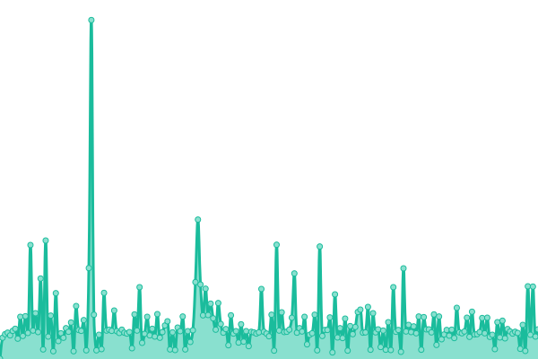

# [📈 Live Status](https://status.tronflix.app): <!--live status--> **🟩 All systems operational**

This repository contains the open-source uptime monitor and status page for [Chris Yocum](https://tronflix.app), powered by [Upptime](https://github.com/upptime/upptime).

With [Upptime](https://upptime.js.org), you can get your own unlimited and free uptime monitor and status page, powered entirely by a GitHub repository. We use [Issues](https://github.com/tronyx/upptime/issues) as incident reports, [Actions](https://github.com/tronyx/upptime/actions) as uptime monitors, and [Pages](https://status.tronflix.app) for the status page.

<!--start: status pages-->
<!-- This summary is generated by Upptime (https://github.com/upptime/upptime) -->
<!-- Do not edit this manually, your changes will be overwritten -->
<!-- prettier-ignore -->
| URL | Status | History | Response Time | Uptime |
| --- | ------ | ------- | ------------- | ------ |
|  [TronFlix](https://tronflix.app) | 🟩 Up | [tron-flix.yml](https://github.com/tronyx/upptime/commits/HEAD/history/tron-flix.yml) | 

 448ms
     
 | 

<a href="https://status.tronflix.app/history/tron-flix">100.00%</a>
    

|  [Plex](https://tronflix.app/plex/web/index.html) | 🟩 Up | [plex.yml](https://github.com/tronyx/upptime/commits/HEAD/history/plex.yml) | 

 246ms
     
 | 

<a href="https://status.tronflix.app/history/plex">100.00%</a>
    

|  [Bitwarden](https://bitwarden.tronflix.app) | 🟩 Up | [bitwarden.yml](https://github.com/tronyx/upptime/commits/HEAD/history/bitwarden.yml) | 

 337ms
     
 | 

<a href="https://status.tronflix.app/history/bitwarden">100.00%</a>
    

|  [Gitea](https://gitea.tronflix.app) | 🟩 Up | [gitea.yml](https://github.com/tronyx/upptime/commits/HEAD/history/gitea.yml) | 

 309ms
     
 | 

<a href="https://status.tronflix.app/history/gitea">100.00%</a>
    

|  [Grafana](https://grafana.tronflix.app) | 🟩 Up | [grafana.yml](https://github.com/tronyx/upptime/commits/HEAD/history/grafana.yml) | 

 281ms
     
 | 

<a href="https://status.tronflix.app/history/grafana">100.00%</a>
    

|  [Jackett](https://tronflix.app/jackett/UI/Login/) | 🟩 Up | [jackett.yml](https://github.com/tronyx/upptime/commits/HEAD/history/jackett.yml) | 

 248ms
     
 | 

<a href="https://status.tronflix.app/history/jackett">100.00%</a>
    

|  [Library](https://library.tronflix.app) | 🟩 Up | [library.yml](https://github.com/tronyx/upptime/commits/HEAD/history/library.yml) | 

 1244ms
     
 | 

<a href="https://status.tronflix.app/history/library">100.00%</a>
    

|  [NZBGet](https://tronflix.app/nzbget/) | 🟩 Up | [nzb-get.yml](https://github.com/tronyx/upptime/commits/HEAD/history/nzb-get.yml) | 

 267ms
     
 | 

<a href="https://status.tronflix.app/history/nzb-get">100.00%</a>
    

|  [NZBHydra](https://tronflix.app/nzbhydra2/) | 🟩 Up | [nzb-hydra.yml](https://github.com/tronyx/upptime/commits/HEAD/history/nzb-hydra.yml) | 

 448ms
     
 | 

<a href="https://status.tronflix.app/history/nzb-hydra">100.00%</a>
    

|  [Ombi](https://tronflix.app/ombi/) | 🟩 Up | [ombi.yml](https://github.com/tronyx/upptime/commits/HEAD/history/ombi.yml) | 

 419ms
     
 | 

<a href="https://status.tronflix.app/history/ombi">100.00%</a>
    

|  [PiHole](https://pihole.tronflix.app/admin/) | 🟩 Up | [pi-hole.yml](https://github.com/tronyx/upptime/commits/HEAD/history/pi-hole.yml) | 

 570ms
     
 | 

<a href="https://status.tronflix.app/history/pi-hole">100.00%</a>
    

|  [Radarr](https://tronflix.app/radarr/activity/queue/) | 🟩 Up | [radarr.yml](https://github.com/tronyx/upptime/commits/HEAD/history/radarr.yml) | 

 225ms
     
 | 

<a href="https://status.tronflix.app/history/radarr">100.00%</a>
    

|  [Radarr4K](https://tronflix.app/radarr4k/activity/queue/) | 🟩 Up | [radarr4-k.yml](https://github.com/tronyx/upptime/commits/HEAD/history/radarr4-k.yml) | 

 263ms
     
 | 

<a href="https://status.tronflix.app/history/radarr4-k">100.00%</a>
    

|  [Sonarr](https://tronflix.app/sonarr/activity/queue/) | 🟩 Up | [sonarr.yml](https://github.com/tronyx/upptime/commits/HEAD/history/sonarr.yml) | 

 170ms
     
 | 

<a href="https://status.tronflix.app/history/sonarr">100.00%</a>
    

|  [Lidarr](https://tronflix.app/lidarr/activity/queue/) | 🟩 Up | [lidarr.yml](https://github.com/tronyx/upptime/commits/HEAD/history/lidarr.yml) | 

 335ms
     
 | 

<a href="https://status.tronflix.app/history/lidarr">100.00%</a>
    

|  [Tautulli](https://tronflix.app/tautulli/status/) | 🟩 Up | [tautulli.yml](https://github.com/tronyx/upptime/commits/HEAD/history/tautulli.yml) | 

 440ms
     
 | 

<a href="https://status.tronflix.app/history/tautulli">100.00%</a>
    

|  [Nagios](https://nagios.tronflix.app) | 🟩 Up | [nagios.yml](https://github.com/tronyx/upptime/commits/HEAD/history/nagios.yml) | 

 268ms
     
 | 

<a href="https://status.tronflix.app/history/nagios">100.00%</a>
    

|  [TheLounge](https://tronflix.app/thelounge/) | 🟩 Up | [the-lounge.yml](https://github.com/tronyx/upptime/commits/HEAD/history/the-lounge.yml) | 

 225ms
     
 | 

<a href="https://status.tronflix.app/history/the-lounge">100.00%</a>
    

|  [qBit](https://tronflix.app/qbit/) | 🟩 Up | [q-bit.yml](https://github.com/tronyx/upptime/commits/HEAD/history/q-bit.yml) | 

 188ms
     
 | 

<a href="https://status.tronflix.app/history/q-bit">100.00%</a>
    

|  [Nextcloud](https://nextcloud.tronflix.app/login) | 🟩 Up | [nextcloud.yml](https://github.com/tronyx/upptime/commits/HEAD/history/nextcloud.yml) | 

 439ms
     
 | 

<a href="https://status.tronflix.app/history/nextcloud">100.00%</a>
    

|  [Chevereto](https://gallery.tronflix.app) | 🟩 Up | [chevereto.yml](https://github.com/tronyx/upptime/commits/HEAD/history/chevereto.yml) | 

 379ms
     
 | 

<a href="https://status.tronflix.app/history/chevereto">100.00%</a>
    

|  [XBackBone](https://sharex.tronflix.app/login) | 🟩 Up | [x-back-bone.yml](https://github.com/tronyx/upptime/commits/HEAD/history/x-back-bone.yml) | 

 374ms
     
 | 

<a href="https://status.tronflix.app/history/x-back-bone">100.00%</a>
    

|  [FileBrowser](https://files.tronflix.app) | 🟩 Up | [file-browser.yml](https://github.com/tronyx/upptime/commits/HEAD/history/file-browser.yml) | 

 277ms
     
 | 

<a href="https://status.tronflix.app/history/file-browser">100.00%</a>
    

|  [Bazarr](https://tronflix.app/bazarr/system/status) | 🟩 Up | [bazarr.yml](https://github.com/tronyx/upptime/commits/HEAD/history/bazarr.yml) | 

 362ms
     
 | 

<a href="https://status.tronflix.app/history/bazarr">100.00%</a>
    

|  [Overseerr](https://overseerr.tronflix.app/login) | 🟩 Up | [overseerr.yml](https://github.com/tronyx/upptime/commits/HEAD/history/overseerr.yml) | 

 949ms
     
 | 

<a href="https://status.tronflix.app/history/overseerr">100.00%</a>
    

|  [Prowlarr](https://tronflix.app/prowlarr/) | 🟩 Up | [prowlarr.yml](https://github.com/tronyx/upptime/commits/HEAD/history/prowlarr.yml) | 

 214ms
     
 | 

<a href="https://status.tronflix.app/history/prowlarr">100.00%</a>
    

<!--end: status pages-->

[**Visit our status website →**](https://status.tronflix.app)

## 📄 License

- Powered by: [Upptime](https://github.com/upptime/upptime)
- Code: [MIT](./LICENSE) © [Chris Yocum](https://tronflix.app)
- Data in the `./history` directory: [Open Database License](https://opendatacommons.org/licenses/odbl/1-0/)
