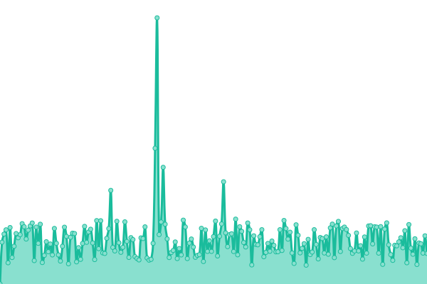
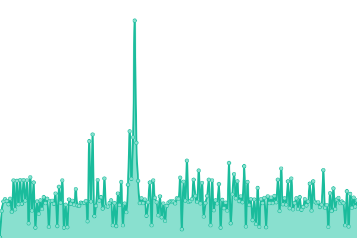
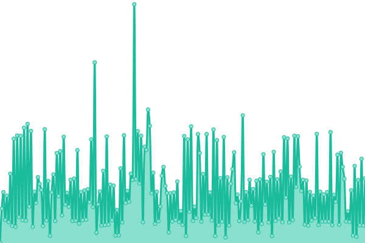
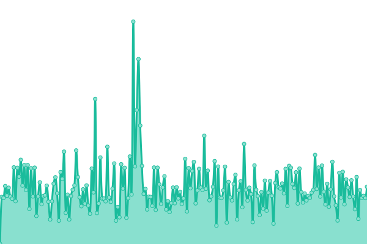

# [📈 Live Status](https://status.tronflix.app): <!--live status--> **🟧 Partial outage**

This repository contains the open-source uptime monitor and status page for [Chris Yocum](https://tronflix.app), powered by [Upptime](https://github.com/upptime/upptime).

With [Upptime](https://upptime.js.org), you can get your own unlimited and free uptime monitor and status page, powered entirely by a GitHub repository. We use [Issues](https://github.com/tronyx/upptime/issues) as incident reports, [Actions](https://github.com/tronyx/upptime/actions) as uptime monitors, and [Pages](https://status.tronflix.app) for the status page.

<!--start: status pages-->
<!-- This summary is generated by Upptime (https://github.com/upptime/upptime) -->
<!-- Do not edit this manually, your changes will be overwritten -->
<!-- prettier-ignore -->
| URL | Status | History | Response Time | Uptime |
| --- | ------ | ------- | ------------- | ------ |
|  [TronFlix](https://tronflix.app) | 🟩 Up | [tron-flix.yml](https://github.com/tronyx/upptime/commits/HEAD/history/tron-flix.yml) | 

 1955ms
     
 | 

<a href="https://status.tronflix.app/history/tron-flix">97.37%</a>
    

|  [Plex](https://tronflix.app/plex/web/index.html) | 🟩 Up | [plex.yml](https://github.com/tronyx/upptime/commits/HEAD/history/plex.yml) | 

 1827ms
     
 | 

<a href="https://status.tronflix.app/history/plex">97.38%</a>
    

|  [Bitwarden](https://bitwarden.tronflix.app) | 🟩 Up | [bitwarden.yml](https://github.com/tronyx/upptime/commits/HEAD/history/bitwarden.yml) | 

 262ms
     
 | 

<a href="https://status.tronflix.app/history/bitwarden">99.75%</a>
    

|  [Gitea](https://gitea.tronflix.app) | 🟩 Up | [gitea.yml](https://github.com/tronyx/upptime/commits/HEAD/history/gitea.yml) | 

 259ms
     
 | 

<a href="https://status.tronflix.app/history/gitea">99.75%</a>
    

|  [Grafana](https://grafana.tronflix.app) | 🟩 Up | [grafana.yml](https://github.com/tronyx/upptime/commits/HEAD/history/grafana.yml) | 

 1851ms
     
 | 

<a href="https://status.tronflix.app/history/grafana">98.08%</a>
    

|  [Library](https://library.tronflix.app) | 🟥 Down | [library.yml](https://github.com/tronyx/upptime/commits/HEAD/history/library.yml) | 

 874ms
     
 | 

<a href="https://status.tronflix.app/history/library">97.74%</a>
    

|  [Ombi](https://tronflix.app/ombi/) | 🟩 Up | [ombi.yml](https://github.com/tronyx/upptime/commits/HEAD/history/ombi.yml) | 

 220ms
     
 | 

<a href="https://status.tronflix.app/history/ombi">97.78%</a>
    

|  [PiHole](https://pihole.tronflix.app/admin/login.php) | 🟩 Up | [pi-hole.yml](https://github.com/tronyx/upptime/commits/HEAD/history/pi-hole.yml) | 

 286ms
     
 | 

<a href="https://status.tronflix.app/history/pi-hole">97.77%</a>
    

|  [PiHole Backup](https://pihole-backup.tronflix.app/admin/login.php) | 🟩 Up | [pi-hole-backup.yml](https://github.com/tronyx/upptime/commits/HEAD/history/pi-hole-backup.yml) | 

 302ms
     
 | 

<a href="https://status.tronflix.app/history/pi-hole-backup">98.70%</a>
    

|  [Radarr](https://tronflix.app/radarr/activity/queue/) | 🟩 Up | [radarr.yml](https://github.com/tronyx/upptime/commits/HEAD/history/radarr.yml) | 

 219ms
     
 | 

<a href="https://status.tronflix.app/history/radarr">98.38%</a>
    

|  [Radarr Anime](https://tronflix.app/radarr-anime/activity/queue/) | 🟩 Up | [radarr-anime.yml](https://github.com/tronyx/upptime/commits/HEAD/history/radarr-anime.yml) | 

 102ms
     
 | 

<a href="https://status.tronflix.app/history/radarr-anime">98.47%</a>
    

|  [Radarr4K](https://tronflix.app/radarr4k/activity/queue/) | 🟩 Up | [radarr4-k.yml](https://github.com/tronyx/upptime/commits/HEAD/history/radarr4-k.yml) | 

 95ms
     
 | 

<a href="https://status.tronflix.app/history/radarr4-k">98.49%</a>
    

|  [Sonarr](https://tronflix.app/sonarr/activity/queue/) | 🟩 Up | [sonarr.yml](https://github.com/tronyx/upptime/commits/HEAD/history/sonarr.yml) | 

 97ms
     
 | 

<a href="https://status.tronflix.app/history/sonarr">98.76%</a>
    

|  [Sonarr Anime](https://tronflix.app/sonarr-anime/login) | 🟩 Up | [sonarr-anime.yml](https://github.com/tronyx/upptime/commits/HEAD/history/sonarr-anime.yml) | 

 103ms
     
 | 

<a href="https://status.tronflix.app/history/sonarr-anime">98.33%</a>
    

|  [Lidarr](https://tronflix.app/lidarr/activity/queue/) | 🟩 Up | [lidarr.yml](https://github.com/tronyx/upptime/commits/HEAD/history/lidarr.yml) | 

 1254ms
     
 | 

<a href="https://status.tronflix.app/history/lidarr">97.90%</a>
    

|  [Tautulli](https://tronflix.app/tautulli/status/) | 🟩 Up | [tautulli.yml](https://github.com/tronyx/upptime/commits/HEAD/history/tautulli.yml) | 

 391ms
     
 | 

<a href="https://status.tronflix.app/history/tautulli">98.19%</a>
    

|  [Nagios](https://nagios.tronflix.app) | 🟥 Down | [nagios.yml](https://github.com/tronyx/upptime/commits/HEAD/history/nagios.yml) | 

 229ms
     
 | 

<a href="https://status.tronflix.app/history/nagios">98.18%</a>
    

|  [qBit](https://tronflix.app/qbit/) | 🟩 Up | [q-bit.yml](https://github.com/tronyx/upptime/commits/HEAD/history/q-bit.yml) | 

 301ms
     
 | 

<a href="https://status.tronflix.app/history/q-bit">90.05%</a>
    

|  [Nextcloud](https://nextcloud.tronflix.app/login) | 🟩 Up | [nextcloud.yml](https://github.com/tronyx/upptime/commits/HEAD/history/nextcloud.yml) | 

 346ms
     
 | 

<a href="https://status.tronflix.app/history/nextcloud">99.75%</a>
    

|  [Chevereto](https://gallery.tronflix.app) | 🟩 Up | [chevereto.yml](https://github.com/tronyx/upptime/commits/HEAD/history/chevereto.yml) | 

 257ms
     
 | 

<a href="https://status.tronflix.app/history/chevereto">99.75%</a>
    

|  [XBackBone](https://sharex.tronflix.app/login) | 🟩 Up | [x-back-bone.yml](https://github.com/tronyx/upptime/commits/HEAD/history/x-back-bone.yml) | 

 261ms
     
 | 

<a href="https://status.tronflix.app/history/x-back-bone">99.75%</a>
    

|  [FileBrowser](https://files.tronflix.app) | 🟩 Up | [file-browser.yml](https://github.com/tronyx/upptime/commits/HEAD/history/file-browser.yml) | 

 396ms
     
 | 

<a href="https://status.tronflix.app/history/file-browser">98.26%</a>
    

|  [Bazarr](https://tronflix.app/bazarr/system/status) | 🟩 Up | [bazarr.yml](https://github.com/tronyx/upptime/commits/HEAD/history/bazarr.yml) | 

 743ms
     
 | 

<a href="https://status.tronflix.app/history/bazarr">98.29%</a>
    

|  [Overseerr](https://overseerr.tronflix.app/login) | 🟥 Down | [overseerr.yml](https://github.com/tronyx/upptime/commits/HEAD/history/overseerr.yml) | 

 470ms
     
 | 

<a href="https://status.tronflix.app/history/overseerr">98.29%</a>
    

|  [Prowlarr](https://tronflix.app/prowlarr/) | 🟩 Up | [prowlarr.yml](https://github.com/tronyx/upptime/commits/HEAD/history/prowlarr.yml) | 

 378ms
     
 | 

<a href="https://status.tronflix.app/history/prowlarr">98.34%</a>
    

|  [Petio](https://tronflix.app/petio/) | 🟩 Up | [petio.yml](https://github.com/tronyx/upptime/commits/HEAD/history/petio.yml) | 

 2147ms
     
 | 

<a href="https://status.tronflix.app/history/petio">98.16%</a>
    

|  [SABnzbd](https://tronflix.app/sabnzbd/) | 🟩 Up | [sa-bnzbd.yml](https://github.com/tronyx/upptime/commits/HEAD/history/sa-bnzbd.yml) | 

 2194ms
     
 | 

<a href="https://status.tronflix.app/history/sa-bnzbd">98.67%</a>
    

<!--end: status pages-->

[**Visit our status website →**](https://status.tronflix.app)

## 📄 License

- Powered by: [Upptime](https://github.com/upptime/upptime)
- Code: [MIT](./LICENSE) © [Chris Yocum](https://tronflix.app)
- Data in the `./history` directory: [Open Database License](https://opendatacommons.org/licenses/odbl/1-0/)
