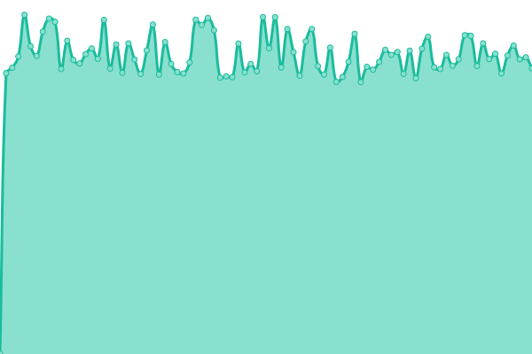

# [📈 Live Status](https://status.tronflix.app): <!--live status--> **🟧 Partial outage**

This repository contains the open-source uptime monitor and status page for [Chris Yocum](https://tronflix.app), powered by [Upptime](https://github.com/upptime/upptime).

With [Upptime](https://upptime.js.org), you can get your own unlimited and free uptime monitor and status page, powered entirely by a GitHub repository. We use [Issues](https://github.com/christronyxyocum/upptime/issues) as incident reports, [Actions](https://github.com/christronyxyocum/upptime/actions) as uptime monitors, and [Pages](https://status.tronflix.app) for the status page.

<!--start: status pages-->
<!-- This summary is generated by Upptime (https://github.com/upptime/upptime) -->
<!-- Do not edit this manually, your changes will be overwritten -->
<!-- prettier-ignore -->
| URL | Status | History | Response Time | Uptime |
| --- | ------ | ------- | ------------- | ------ |
|  [TronFlix](https://tronflix.app) | 🟩 Up | [tron-flix.yml](https://github.com/christronyxyocum/upptime/commits/master/history/tron-flix.yml) | 

 399ms
     
 | 

<a href="https://status.tronflix.app/history/tron-flix">100.00%</a>
    

|  [Plex](https://tronflix.app/plex/) | 🟥 Down | [plex.yml](https://github.com/christronyxyocum/upptime/commits/master/history/plex.yml) | 

 411ms
     
 | 

<a href="https://status.tronflix.app/history/plex">99.21%</a>
    

|  [Bitwarden](https://bitwarden.tronflix.app) | 🟩 Up | [bitwarden.yml](https://github.com/christronyxyocum/upptime/commits/master/history/bitwarden.yml) | 

 289ms
     
 | 

<a href="https://status.tronflix.app/history/bitwarden">100.00%</a>
    

|  [Gitea](https://gitea.tronflix.app) | 🟩 Up | [gitea.yml](https://github.com/christronyxyocum/upptime/commits/master/history/gitea.yml) | 

 289ms
     
 | 

<a href="https://status.tronflix.app/history/gitea">100.00%</a>
    

|  [Grafana](https://grafana.tronflix.app) | 🟩 Up | [grafana.yml](https://github.com/christronyxyocum/upptime/commits/master/history/grafana.yml) | 

 199ms
     
 | 

<a href="https://status.tronflix.app/history/grafana">100.00%</a>
    

|  [Jackett](https://tronflix.app/jackett/) | 🟩 Up | [jackett.yml](https://github.com/christronyxyocum/upptime/commits/master/history/jackett.yml) | 

 473ms
     
 | 

<a href="https://status.tronflix.app/history/jackett">100.00%</a>
    

|  [Library](https://library.tronflix.app) | 🟩 Up | [library.yml](https://github.com/christronyxyocum/upptime/commits/master/history/library.yml) | 

 1108ms
     
 | 

<a href="https://status.tronflix.app/history/library">100.00%</a>
    

|  [NZBGet](https://tronflix.app/nzbget/) | 🟩 Up | [nzb-get.yml](https://github.com/christronyxyocum/upptime/commits/master/history/nzb-get.yml) | 

 312ms
     
 | 

<a href="https://status.tronflix.app/history/nzb-get">100.00%</a>
    

|  [NZBHydra](https://tronflix.app/nzbhydra2/) | 🟩 Up | [nzb-hydra.yml](https://github.com/christronyxyocum/upptime/commits/master/history/nzb-hydra.yml) | 

 361ms
     
 | 

<a href="https://status.tronflix.app/history/nzb-hydra">100.00%</a>
    

|  [Ombi](https://tronflix.app/ombi/) | 🟩 Up | [ombi.yml](https://github.com/christronyxyocum/upptime/commits/master/history/ombi.yml) | 

 324ms
     
 | 

<a href="https://status.tronflix.app/history/ombi">100.00%</a>
    

|  [PiHole](https://pihole.tronflix.app) | 🟩 Up | [pi-hole.yml](https://github.com/christronyxyocum/upptime/commits/master/history/pi-hole.yml) | 

 536ms
     
 | 

<a href="https://status.tronflix.app/history/pi-hole">100.00%</a>
    

|  [Radarr](https://tronflix.app/radarr/) | 🟩 Up | [radarr.yml](https://github.com/christronyxyocum/upptime/commits/master/history/radarr.yml) | 

 282ms
     
 | 

<a href="https://status.tronflix.app/history/radarr">100.00%</a>
    

|  [Radarr4K](https://tronflix.app/radarr4k/) | 🟩 Up | [radarr4-k.yml](https://github.com/christronyxyocum/upptime/commits/master/history/radarr4-k.yml) | 

 365ms
     
 | 

<a href="https://status.tronflix.app/history/radarr4-k">100.00%</a>
    

|  [Sonarr](https://tronflix.app/sonarr/) | 🟩 Up | [sonarr.yml](https://github.com/christronyxyocum/upptime/commits/master/history/sonarr.yml) | 

 281ms
     
 | 

<a href="https://status.tronflix.app/history/sonarr">100.00%</a>
    

|  [Lidarr](https://tronflix.app/lidarr/) | 🟩 Up | [lidarr.yml](https://github.com/christronyxyocum/upptime/commits/master/history/lidarr.yml) | 

 278ms
     
 | 

<a href="https://status.tronflix.app/history/lidarr">100.00%</a>
    

|  [Tautulli](https://tronflix.app/tautulli/) | 🟩 Up | [tautulli.yml](https://github.com/christronyxyocum/upptime/commits/master/history/tautulli.yml) | 

 488ms
     
 | 

<a href="https://status.tronflix.app/history/tautulli">100.00%</a>
    

|  [Nagios](https://nagios.tronflix.app) | 🟩 Up | [nagios.yml](https://github.com/christronyxyocum/upptime/commits/master/history/nagios.yml) | 

 211ms
     
 | 

<a href="https://status.tronflix.app/history/nagios">1.65%</a>
    

|  [TheLounge](https://tronflix.app/thelounge/) | 🟩 Up | [the-lounge.yml](https://github.com/christronyxyocum/upptime/commits/master/history/the-lounge.yml) | 

 291ms
     
 | 

<a href="https://status.tronflix.app/history/the-lounge">100.00%</a>
    

|  [Deluge](https://tronflix.app/deluge/) | 🟩 Up | [deluge.yml](https://github.com/christronyxyocum/upptime/commits/master/history/deluge.yml) | 

 265ms
     
 | 

<a href="https://status.tronflix.app/history/deluge">100.00%</a>
    

|  [Nextcloud](https://nextcloud.tronflix.app) | 🟩 Up | [nextcloud.yml](https://github.com/christronyxyocum/upptime/commits/master/history/nextcloud.yml) | 

 525ms
     
 | 

<a href="https://status.tronflix.app/history/nextcloud">100.00%</a>
    

|  [Chevereto](https://gallery.tronflix.app) | 🟩 Up | [chevereto.yml](https://github.com/christronyxyocum/upptime/commits/master/history/chevereto.yml) | 

 334ms
     
 | 

<a href="https://status.tronflix.app/history/chevereto">100.00%</a>
    

|  [XBackBone](https://sharex.tronflix.app) | 🟩 Up | [x-back-bone.yml](https://github.com/christronyxyocum/upptime/commits/master/history/x-back-bone.yml) | 

 361ms
     
 | 

<a href="https://status.tronflix.app/history/x-back-bone">100.00%</a>
    

|  [MediaButler](https://tronflix.app/mediabutler/) | 🟩 Up | [media-butler.yml](https://github.com/christronyxyocum/upptime/commits/master/history/media-butler.yml) | 

 165ms
     
 | 

<a href="https://status.tronflix.app/history/media-butler">100.00%</a>
    

|  [Netdata](https://tronflix.app/netdata/) | 🟩 Up | [netdata.yml](https://github.com/christronyxyocum/upptime/commits/master/history/netdata.yml) | 

 545ms
     
 | 

<a href="https://status.tronflix.app/history/netdata">100.00%</a>
    

|  [FileBrowser](https://files.tronflix.app) | 🟩 Up | [file-browser.yml](https://github.com/christronyxyocum/upptime/commits/master/history/file-browser.yml) | 

 185ms
     
 | 

<a href="https://status.tronflix.app/history/file-browser">100.00%</a>
    

|  [Tdarr](https://tdarr.tronflix.app) | 🟩 Up | [tdarr.yml](https://github.com/christronyxyocum/upptime/commits/master/history/tdarr.yml) | 

 409ms
     
 | 

<a href="https://status.tronflix.app/history/tdarr">100.00%</a>
    

|  [Bazarr](https://tronflix.app/bazarr/) | 🟩 Up | [bazarr.yml](https://github.com/christronyxyocum/upptime/commits/master/history/bazarr.yml) | 

 424ms
     
 | 

<a href="https://status.tronflix.app/history/bazarr">100.00%</a>
    

<!--end: status pages-->

[**Visit our status website →**](https://status.tronflix.app)

## 📄 License

- Powered by: [Upptime](https://github.com/upptime/upptime)
- Code: [MIT](./LICENSE) © [Chris Yocum](https://tronflix.app)
- Data in the `./history` directory: [Open Database License](https://opendatacommons.org/licenses/odbl/1-0/)
